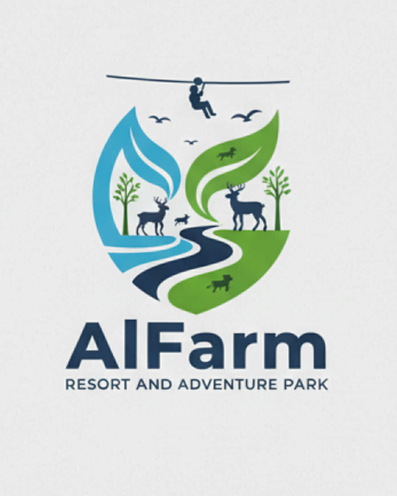

# AlFarm Resort and Adventure Park

A full-stack resort management system with a beautiful public website built with Next.js, React, TypeScript, Tailwind CSS, and PostgreSQL.



## 🌟 Features

### Public Website
- ✅ Beautiful, responsive design matching the AlFarm brand
- ✅ Home page with hero section and features
- ✅ About page with resort information
- ✅ Accommodations page with room types and pricing
- ✅ Activities page showcasing all adventures
- ✅ Photo gallery
- ✅ Contact page with inquiry form
- ✅ Mobile-responsive navigation

### Guest Features
- ✅ User registration and authentication
- ✅ Personal dashboard
- ✅ Browse available rooms
- ✅ Make room reservations (UI ready, booking system to be implemented)
- ✅ View booking history
- ✅ Manage profile

### Admin Features
- ✅ Secure admin login
- ✅ Admin dashboard with statistics
- ✅ Manage bookings (view, update status, cancel)
- ✅ Manage rooms (add, edit, delete)
- ✅ Manage amenities
- ✅ View guest information

## 🛠️ Tech Stack

- **Frontend**: Next.js 14 (App Router), React 18, TypeScript
- **Styling**: Tailwind CSS with custom AlFarm theme
- **Backend**: Next.js API Routes
- **Database**: PostgreSQL
- **Authentication**: JWT with bcryptjs
- **Icons**: React Icons

## 📋 Prerequisites

Before you begin, ensure you have the following installed:
- Node.js 18+ ([Download](https://nodejs.org/))
- PostgreSQL 12+ ([Download](https://www.postgresql.org/download/))
- npm or yarn package manager

## 🚀 Installation & Setup

### 1. Install Dependencies

```bash
cd alfarm-resort
npm install
```

### 2. Setup PostgreSQL Database

#### Option A: Using psql command line

```bash
# Login to PostgreSQL
psql -U postgres

# Create database
CREATE DATABASE alfarm_resort;

# Connect to the database
\c alfarm_resort

# Exit psql
\q

# Import the schema
psql -U postgres -d alfarm_resort -f database/schema.sql
```

#### Option B: Using pgAdmin

1. Open pgAdmin
2. Create a new database named `alfarm_resort`
3. Open the Query Tool for the new database
4. Copy and paste the contents of `database/schema.sql`
5. Execute the script

### 3. Create Admin User with Correct Password

The schema includes a placeholder for the admin user. You need to create it with a proper password hash:

```bash
# Generate the password hash
node scripts/generate-admin-hash.js
```

This will output a hash for the password `admin123`. Copy the entire INSERT statement and run it in your PostgreSQL database:

```sql
INSERT INTO users (email, password, first_name, last_name, role)
VALUES ('admin@alfarm.com', 'YOUR_GENERATED_HASH_HERE', 'Admin', 'User', 'root');
```

### 4. Configure Environment Variables

Edit the `.env.local` file with your PostgreSQL credentials:

```env
# Database Configuration
DB_HOST=localhost
DB_PORT=5432
DB_USER=postgres
DB_PASSWORD=your_postgres_password
DB_NAME=alfarm_resort

# JWT Secret (Change this in production!)
JWT_SECRET=your-super-secret-jwt-key-change-this-in-production

# Application
NEXT_PUBLIC_APP_NAME=AlFarm Resort and Adventure Park
NEXT_PUBLIC_APP_URL=http://localhost:3000
```

### 5. Run the Development Server

```bash
npm run dev
```

Open [http://localhost:3000](http://localhost:3000) in your browser.

## 🔐 Default Login Credentials

### Admin/Root Access
- **URL**: http://localhost:3000/admin/login
- **Email**: `admin@alfarm.com`
- **Password**: `admin123`

### Guest Access
- **URL**: http://localhost:3000/guest/register
- Create a new account to access guest features

## 📁 Project Structure

```
alfarm-resort/
├── app/                          # Next.js app directory
│   ├── (public pages)/
│   │   ├── page.tsx             # Home page
│   │   ├── about/               # About page
│   │   ├── rooms/               # Accommodations
│   │   ├── activities/          # Activities
│   │   ├── gallery/             # Photo gallery
│   │   └── contact/             # Contact page
│   ├── admin/                   # Admin section
│   │   ├── login/              # Admin login
│   │   └── dashboard/          # Admin dashboard
│   ├── guest/                   # Guest section
│   │   ├── login/              # Guest login
│   │   ├── register/           # Guest registration
│   │   └── dashboard/          # Guest dashboard
│   ├── api/                     # API routes
│   │   └── auth/               # Authentication endpoints
│   ├── globals.css             # Global styles
│   └── layout.tsx              # Root layout
├── components/
│   ├── Navigation.tsx          # Main navigation
│   └── Footer.tsx              # Footer component
├── database/
│   └── schema.sql              # PostgreSQL schema
├── lib/
│   ├── db.ts                   # Database connection
│   └── auth.ts                 # Authentication utilities
├── public/
│   └── logo.png                # AlFarm logo
├── scripts/
│   └── generate-admin-hash.js  # Password hash generator
├── types/
│   └── index.ts                # TypeScript types
└── ...config files
```

## 🎨 Design Theme

The website uses AlFarm's brand colors:
- **Primary Blue**: #4A90A4 (from the logo's water element)
- **Secondary Green**: #6FB96F (from the logo's nature element)
- **Accent Navy**: #2C3E50 (from the logo's dark elements)

## 🔧 Database Schema

### Tables
- **users** - User accounts (admin, root, and guests)
- **rooms** - Room inventory
- **amenities** - Resort amenities
- **room_amenities** - Many-to-many relationship
- **bookings** - Guest reservations

## 📝 API Endpoints

### Authentication
- `POST /api/auth/login` - User login
- `POST /api/auth/register` - User registration

### Rooms (To be implemented)
- `GET /api/rooms` - Get all rooms
- `POST /api/rooms` - Create room (admin only)
- `PUT /api/rooms/[id]` - Update room (admin only)
- `DELETE /api/rooms/[id]` - Delete room (admin only)

### Bookings (To be implemented)
- `GET /api/bookings` - Get bookings
- `POST /api/bookings` - Create booking
- `PUT /api/bookings/[id]` - Update booking
- `DELETE /api/bookings/[id]` - Cancel booking

### Amenities (To be implemented)
- `GET /api/amenities` - Get all amenities
- `POST /api/amenities` - Create amenity (admin only)
- `DELETE /api/amenities/[id]` - Delete amenity (admin only)

## 🚧 Features to Implement

- [ ] Complete booking system (create, view, manage)
- [ ] Room availability calendar
- [ ] Payment integration
- [ ] Email notifications
- [ ] Image upload for rooms and gallery
- [ ] Reviews and ratings
- [ ] Search and filter functionality
- [ ] Admin reports and analytics
- [ ] Guest booking management
- [ ] Multi-language support

## 🐛 Troubleshooting

### Cannot connect to database
- Verify PostgreSQL is running: `sudo service postgresql status`
- Check credentials in `.env.local`
- Ensure database `alfarm_resort` exists

### Module not found errors
```bash
rm -rf node_modules package-lock.json
npm install
```

### Port 3000 already in use
```bash
# Use a different port
npm run dev -- -p 3001
```

### Admin login not working
- Ensure you've created the admin user with proper password hash
- Verify the email is `admin@alfarm.com` and password is `admin123`
- Check database connection

## 📦 Build for Production

```bash
# Build the application
npm run build

# Start production server
npm start
```

## 🌐 Deployment

### Vercel (Recommended for Next.js)
1. Push your code to GitHub
2. Import project in Vercel
3. Add environment variables
4. Deploy

### Database Hosting
- **Supabase** (PostgreSQL hosting)
- **Railway** (PostgreSQL + App hosting)
- **Heroku** (PostgreSQL addon)
- **AWS RDS** (PostgreSQL)

## 📄 License

MIT License - feel free to use this project for your own purposes.

## 🤝 Support

For questions or issues:
- Check the troubleshooting section
- Review the code comments
- Create an issue in the repository

## 🎉 Credits

Built with ❤️ for AlFarm Resort and Adventure Park

---

**Happy Coding! 🚀**
